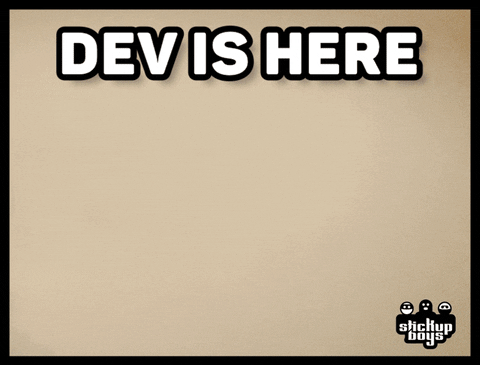

<h1 align="center">Hi there, I'm Md. Almas Ali! </h1>
<!-- <h3 align="center">Passionate Software Engineer | Open Source Enthusiast</h3> -->

## About Me

- 🔭 I’m currently working on **Backend Development**

- 🌱 I’m currently learning **New technologies and frameworks everyday**

- 👯 I’m looking to collaborate on **Open Source**

- 💬 Ask me about **Anything related to Software Development**

- 📫 How to reach me **almaspr3@gmail.com**

- ⚡ Fun fact **I have some perfect tools for your next project.**

<h2 align="center">📊 Progress Stats:</h2>

---

---

| Overview | In Detail |
|--------|----------|
|  |  |

---

| Overview | In Detail | Repositories |
|--------|----------|-------------------|
|  |  |  |

---

 

---

| Wakatime | Hire me |
|----------|---------|
|  |  |

## Languages and Tools:

## Connect with me:

[Check my portfolio website](https://almasali.net "Almas Ali Portfolio") or check my other social media account here.

## ✍️ Need Inspiration?

## Want to show your support?

By supporting me you are supporting the hole open-source community.

 
 
 

Do you like my open source projects? <a href='https://stars.github.com/nominate/'>Nominate me to Github Stars
⭐</a>

